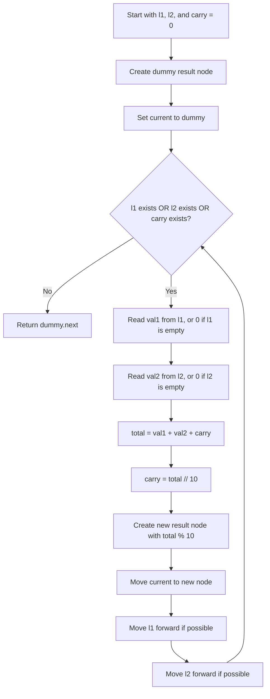

# Add Two Numbers Flowchart

## Key Idea

The linked lists store digits in reverse order, so the algorithm adds one digit
pair at a time from left to right, carrying any overflow into the next step.
